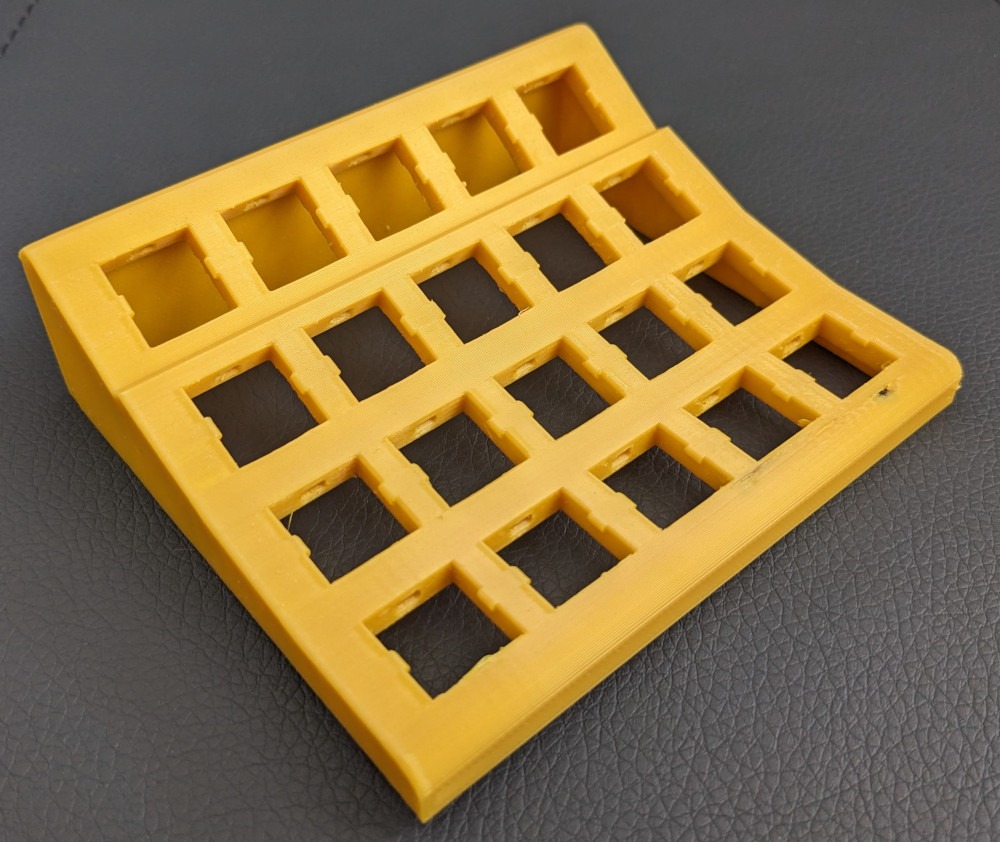

A 4x5 nav/macro keyboard.

- Fits MX switches.
- Designed for DSA profile keycaps, but I expect other profiles will work fine too.

About the model:

- [Python model generator](src/navpad/model.py) --> OpenSCAD [model](model.scad) --> [STL](model.stl).
- Python model generator uses [scadgen](https://github.com/tcteo/scadgen)!

## Photos

### OpenSCAD preview

### Printed and Assembed

With switches:

Assembled, with keycaps:

Side view, with DSA keycaps:

Side view, with SA keycaps in the top row:

